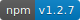
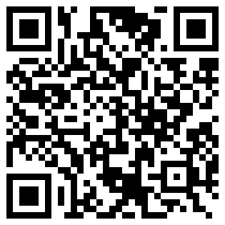

# ml-ui 
[](https://www.npmjs.com/package/ml-ui) 


> 基于 Vue 2.0 的 Mobile 组件库 ml-ui

> Version～1.3.7

摘要: ml-ui，一套为开发者、设计师和产品经理准备的基于 Vue 2 的移动端组件库

网上轮子已经很多了哈，咋也凑个热闹，开源自己的Vue.js的移动端组件库。粗糙了点哈！

有兴趣的可以一起来新增、完善组件！

* Toast 提示
* Message 消息
* Popup 弹窗
* ActiveSheet 活动表
* Icon 图标
* Header 顶部导航栏
* Button 按钮
* Radio 单选
* Checkbox 多选
* Switch 开关
* Range 范围
* IView 图片预览组件
* DatePater 日期、时间选择器
* Tab 选项卡
* Slide 幻灯片
* Model 遮罩层
* Pull 上拉加载 下拉刷新
* AutoLoad 底部自动加载
* Loading 正在加载...
* LeftSlip 左滑

欢迎在issues提出建议和Bug

秋风会继续改进中。。。喜欢的顺便点个start 


## 安装
```npm
npm install ml-ui -S
```

## 使用
```js
import Vue from 'vue'
import MlUi from 'ml-ui'
import 'ml-ui/styles/index.css'

Vue.use(MlUi)
```

目前压缩后为70k大小 

md文档地址 [www.ml-ui.com](http://www.ml-ui.com)


组件预览地址 [www.ml-ui.com/#/demo/index](http://www.ml-ui.com/#/demo/index)

构建部署环境基于[vue-webpack-config](https://github.com/zdliuccit/vue-webpack-config)

构建技术栈

* Webpack3
* Koa2
* Axios
* Vue2 & vue-router
* Babel Es6/7
* Eslint
* stylus postcss

有兴趣的同学可以看看，顺便贡献出你们的star哈～

扫码预览



## Other Contributors
* [medz](https://github.com/medz)
* [dsh0416](https://github.com/dsh0416)